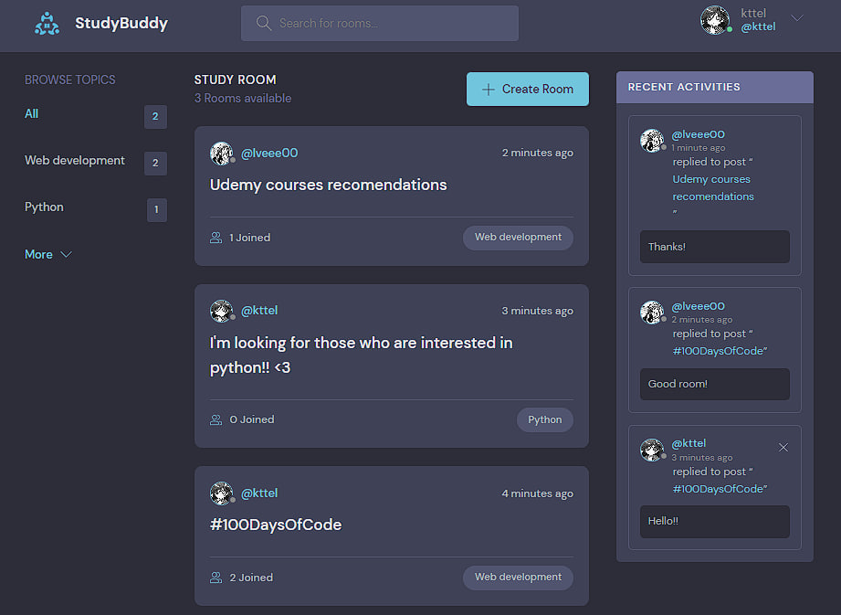
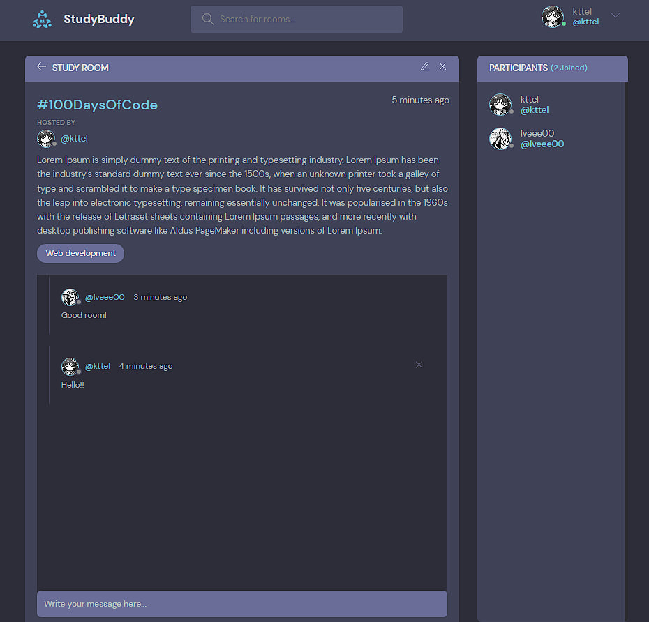
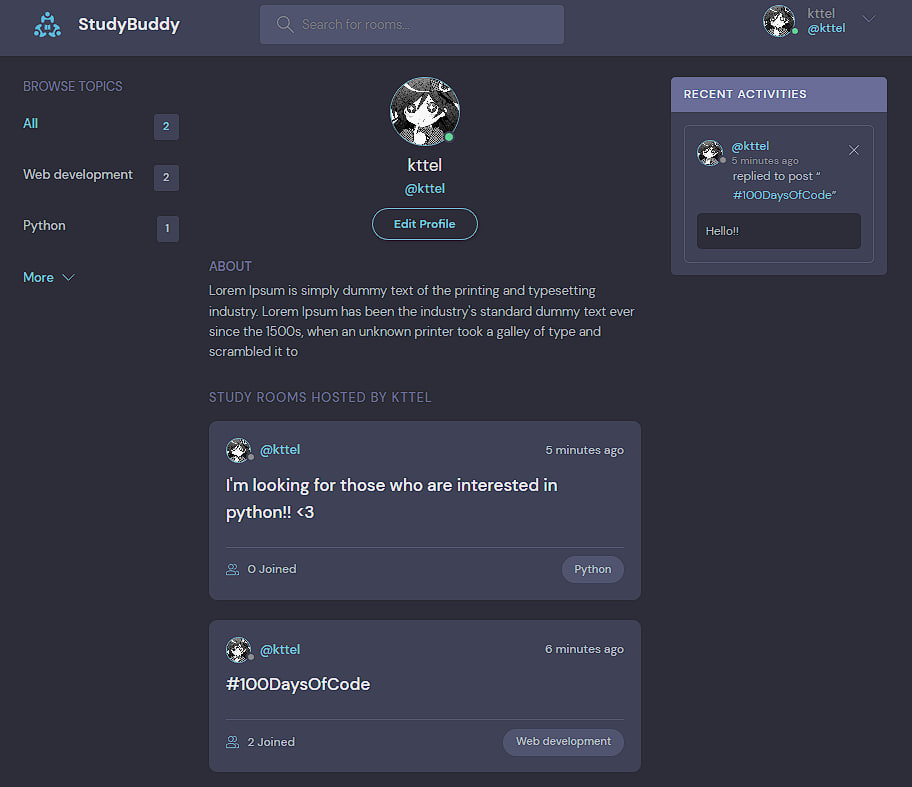
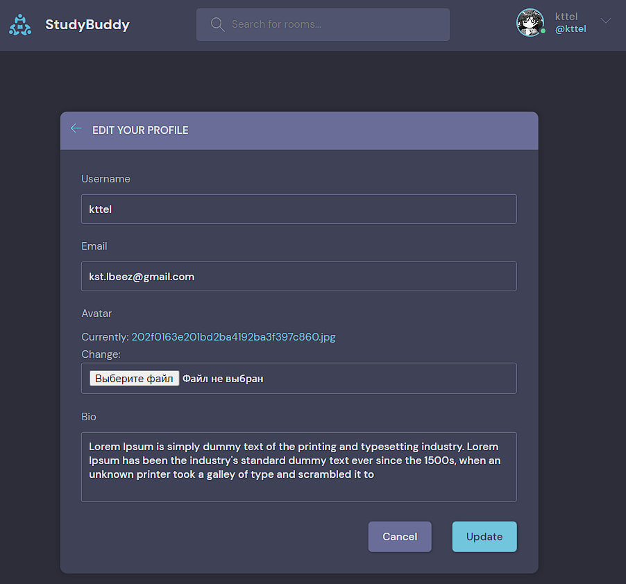

# StudyBud [](https://www.python.org/)

Python Django application to find study partners

## Features

- you can register your own account and login to it;
- you can edit your profile information;
- CRUD for rooms, creating and deleting for room messages;
- joining to the rooms.

## Steps to be followed for first time use
- run this command to clone this repository
```bash
git clone https://github.com/kttel/studybud.git
```
- add new virtual environment in project directory and install all neccessary libraries from requirements.txt
```bash
cd studybud

python -m venv env

pip install -r requirements.txt
```
- create file .env with your configurations
```
SECRET_KEY=<your_secret_key>
DEBUG=1
DB_NAME=<your_db_name>
DB_USER=<your_db_user>
DB_PASSWORD=<your_db_password>
DB_HOST=localhost # or your database host
DB_PORT=3306 # or your database port
```
- in project run this commands to work with database
```bash
python manage.py makemigrations

python manage.py migrate
```
- create superuser to work with admin panel 
```
python manage.py createsuperuser
```
## Usage

- in the directory with manage.py file run this command
```
python manage.py runserver
```
## Screenshots

<div align='center'>






</div>

## Contributing
Various pull requests are welcome. Project can be updated in any time.

Last update: 18.02.2023
